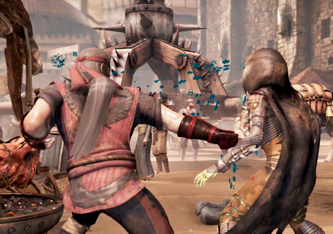
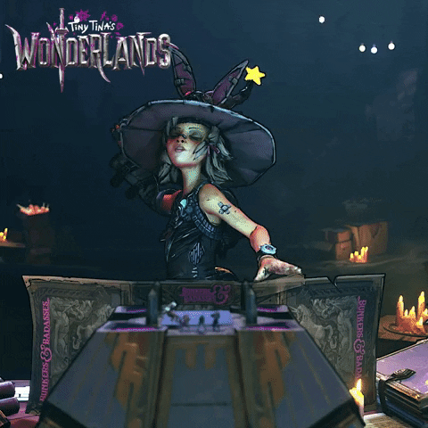

<h1 align="center">Oi 👋, Eu sou o Danrley</h1>
<h3 align="center">Programador em Ascenção</h3>

<h1>
<h3 align="left">Minhas Redes:</h3>

<h1>

<h3 align="left">Linguagens e ferramentas que já utilizei:</h3>

                

<h1>

<h3> Sobre Mim</h3>

 Sou Danrley, teho 21 anos, formado em Analise e Desenvolvimento de Sistemas e um grande apetite por consumir tecnologias. Adoro Front-End, mas como não é só de beleza vive um homem,  acabou praticando mais o Back-End. 
Gosto muito de jogos, desde virtuais até jogos de mesa, já fui mestre de mesas de D&D5e por 5 anos e jogador a 8, minha franquia de jogos favorita com toda certeza é Final Fantasy e Borderlands

<h3> Alguns links sobre mim: </h3>

<table width="100%">
<tr>
<td>
<h3 align="center">Última música que eu ouvi</h3>

 <a href="https://www.youtube.com/watch?v=qJlMkMtK7-8" target="_blank"> 
</td>
<td>
<h3 align=center> Estou jogando constantemente: <h3> 

 <a href="https://www.elderscrollsonline.com/en-us/home" target="_blank"> 
</td>
<td>
<h3 align=center> Ficha do meu ultimo personagem Dnd5e: <h3> 

 <a href="https://drive.google.com/file/d/1XrKDlUGJyme0ZhvA-vEX1beT5GHpICnM/view?usp=sharing" target="_blank"> 
</td>
</tr>
</table>

<h1>

